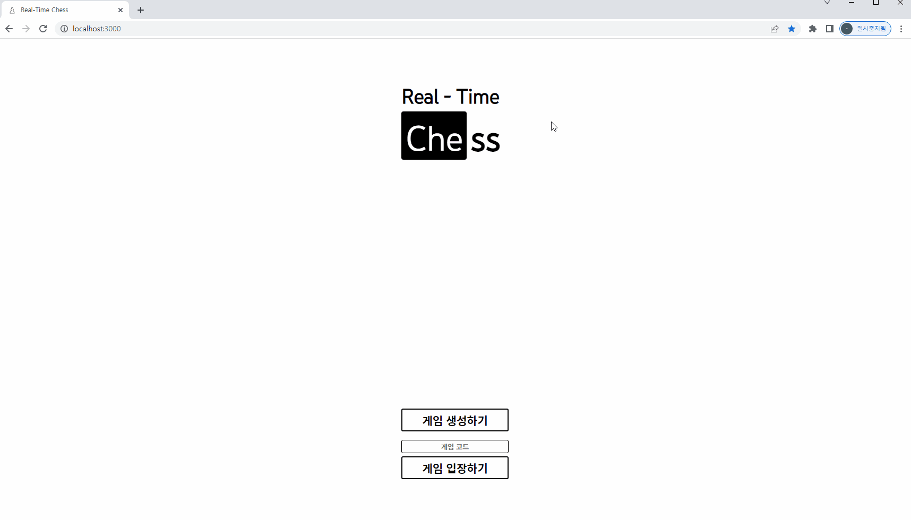
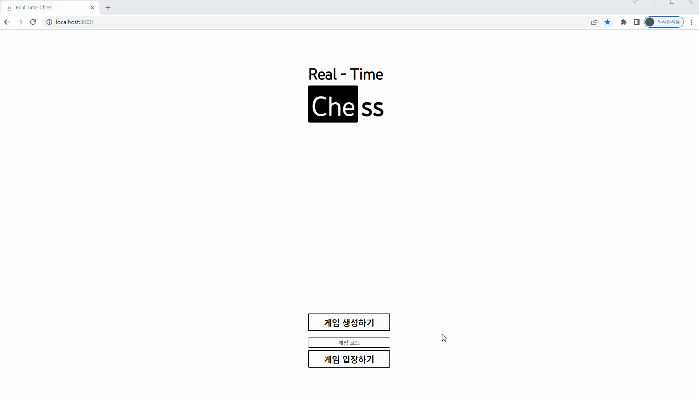
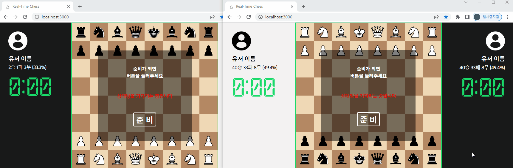
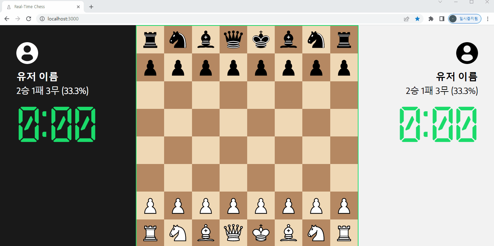
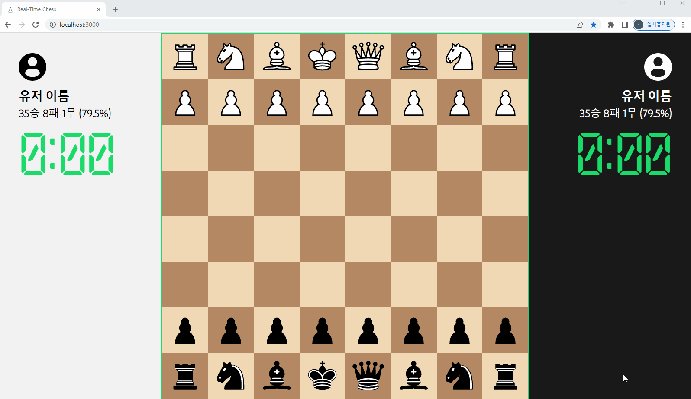
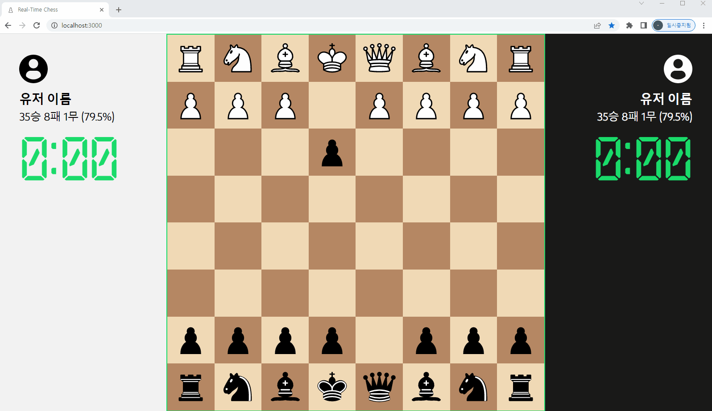
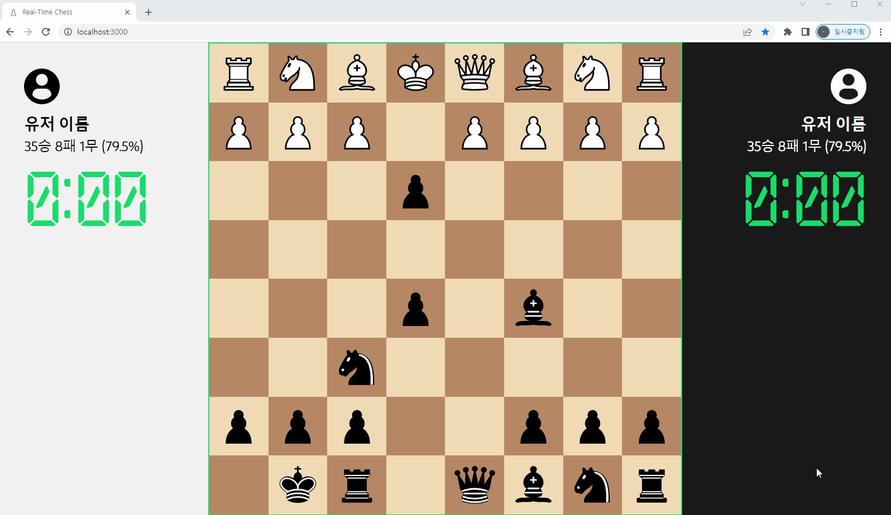
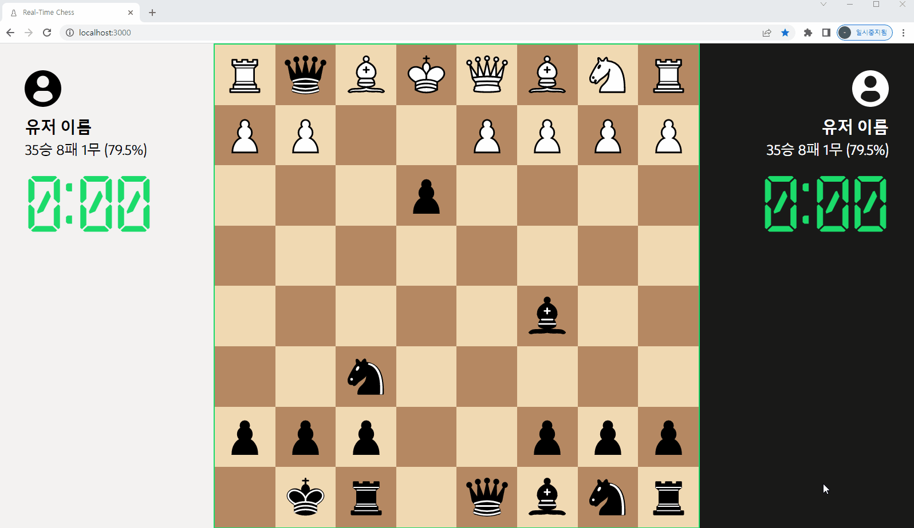
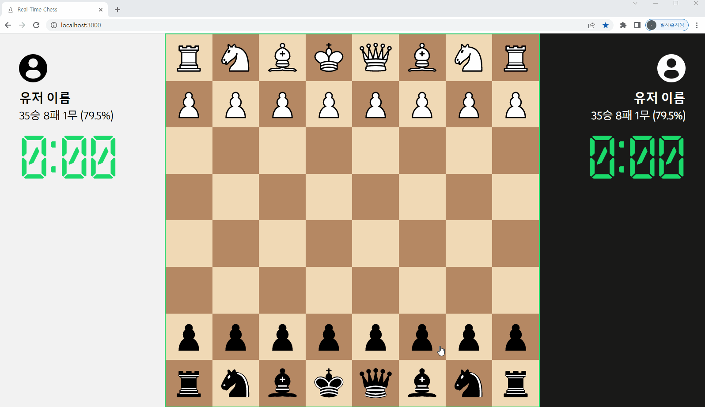
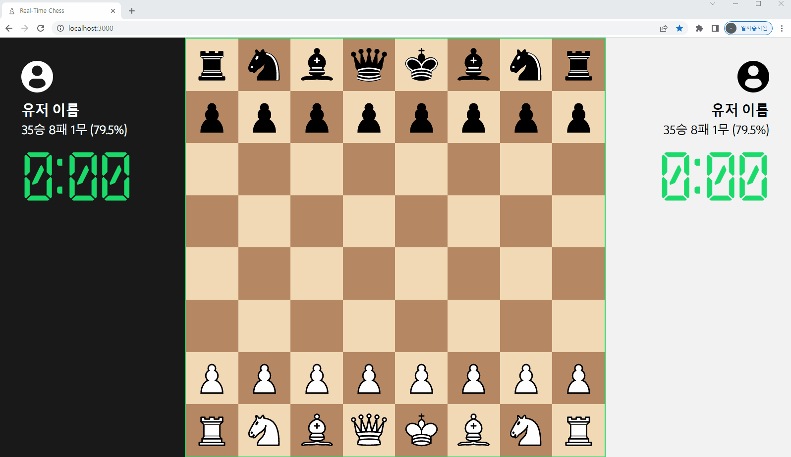

# Real - Time Chess

### 프로젝트를 시작한 계기

취미로 즐겨하는 체스 퍼즐을 풀고 있다가 문뜩 **체스가 턴제(Turn-Based)가 아니라 실시간으로 진행되면 어떨까?**라는 생각이 들어서 시작한 프로젝트.

 

### 게임의 재미를 위해서 고려한 요소들

* 게임의 진행속도가 너무 빨라서 **생각없이 기물을 많이 움직이는 전략**이 절대적으로 유리해서는 안된다. 

  * 그래서 기물을 움직인 후에 다음 움직임까지 **대기시간**을 만들었다.

  

* 각 플레이어가 대기시간이 끝날 때마다 바로 움직인다면 **턴제와 똑같은 형태**를 가진다. 
  * 그래서 **대기시간을 매우 짧게 설정**하여(1 ~ 3초) 그런 상황은 오프닝에서만 일어나도록 제한.
  * 기물을 움직이지 않는것이 더 유리한 경우나 상대의 움직임을 보고나서 기물을 움직이고 싶은 경우에 **대기시간이 돌아와도 의도적으로 움직이지 않는 전략**을 사용할 수 있다.


* 적절한 대기시간이나 의도적으로 움직이지 않는 시간에 제한이 필요한지는 **경험적으로 조정**이 필요해 보인다.
  * 특정 기물 배치를 만들고 움직이지 않는 것이 유리한 경우가 존재한다면, **의도적으로 움직이지 않을 수 있는 시간에 제한**을 두어야 할 것으로 보인다.
  * 대기시간은 게임을 생성할 때 **사용자들이 설정** 할 수 있도록 한다.


* **시작부터 실시간으로 진행**하는 방법과 **초반은 턴제로 진행, 일정 턴을 기점으로 실시간으로 진행**하는 방법 중 뭐가 더 재미있을까.
  * 체스에서 **백이 첫 턴에 먼저 움직이는 룰**이 있는데, 이 룰에 의해서 **백이 평균적으로 높은 승률**을 가진다.
  * 첫번째 방법은 **첫 턴을 흑백이 동시에 시작**하기 때문에 체스의 이러한 문제를 해결할 수 있다는 장점이 있다.
  * 두번째 방법은 턴제로 진행되는 **초반에 상대를 탐색하고 실시간으로 변하는 시점 이후를 설계 하는 재미**가 있을 것이라 예상한다.
  * **시작 대기시간**과 **최소 대기시간**을 정한 후에 **매 턴마다 대기시간을 줄여나가는 방식**으로 두가지 방식의 장점을 가져갈 수 있을 것 같다.


* **위험한 수**를 플레이어에게 알려 줄 것인가? **체크** 또는 **체크메이트** 상황을 플레이어에게 알려줄 것인가?
  * **스피드 체스**의 재미있는 점 중 하나는 부족한 시간 때문에 치명적인 실수를 하는 것뿐만 아니라 부족한 시간 때문에 **상대가 나의 실수를 포착하지 못하는 경우**가 발생한다는 점도 있다.
  * chess.com의 경우에 **바로 다음 수에 자신의 킹이 공격받는 수**를 둘 수 없도록 설정되어 있다. 그리고 **어떤 움직임으로도 자신의 킹이 공격받는 것을 막을 수 없는 경우**는 체크메이트로 상대방 또는 자신이 체크메이트를 만드는 순간에 게임이 종료된다.
  * 시스템적으로 게임을 바로 패배할 수 있는 수를 제한하지 않아서 허무하게 질 수도 있고, 의도하지 않은 체크메이트 상황인 경우에 체크메이트임을 알아차리지 못하고 게임을 끝내지 못하는 상황도 발생하는 것이 **실시간 체스로서의 재미**가 아닐까 생각했다. 
  * 사용자가 **두가지 중 선택해서 진행**하면 되기때문에 **게임을 생성할 때 옵션으로 선택**할 수 있도록 한다.


### TechStacks 사용기

실시간 체스에 흥미가 생겨서 시작한 프로젝트지만 이 프로젝트를 기회로 새로운 기술들을 경험해보기로 생각했었다.


#### 1. TypeScript

TypeSciprt는 필요성에 의해서 도입했다기 보다는 TypeScript 개발 경험을 쌓기 위해서 사용했다.

```typescript
// Constants/Types.tsx 
export interface Position {
    column: number;
    row: number;
}

export interface gameLog {
    name: string;
    isWhite: boolean;
    from: Position;
    to: Position;
}

// 테이블의 모든 정보를 담고 있는 객체 Pieces 
// Pieces : Array<Array<Piece>>
export interface Piece {
    name: string; // 'king', 'queen', 'rook', 'bishop', 'knight', 'empty'
    isMoved: boolean;
    isWhite: boolean;
    isFocused: boolean; // 현재 선택 되어있는지 여부
    canMoveNow: boolean; // 선택 된 기물이 이동 할 수 있는 칸
}

```

각 Component들에 선언한 `interface Props{}`들을 제외하고 결과적으로 선언된 객체의 타입은 위의 3개밖에 없었다.

체스에서 플레이어의 동작이 기물을 한 좌표에서 다른 좌표로 옮기는 것이 전부이기 때문에 입력값들이 워낙 명확했다.

그래서 함수에 여러 타입이 입력으로 들어올 수 있는 상황이 없었기 때문에 함수의 매개변수 타입을 신경쓰느라 고생한 경험은 딱히 없었다.

 

Piece 객체에서 isFocused와 canMoveNow는 사실 Piece에 대한 정보가 아니라 Piece가 밟고있는 Tile에 대한 정보다.

게임 테이블에 대한 정보를 Pieces라는 객체 하나로 다루다 보니 처음 구현할 때 같은 좌표에 있는 Piece와 Tile의 정보를 동시에 담게 만들었다. (비어 있는 타일에는 empty라는 기물이 있는 형태)

```typescript
export interface Piece {
    name: string; // 'king', 'queen', 'rook', 'bishop', 'knight', 'empty'
    isMoved: boolean;
    isWhite: boolean; // 기물의 색상
}

export interface Tile {
    isWhite: boolean; // 타일의 색상(현재는 column과 row로 계산해서 결정하고 있음)
    isFocused: boolean; // 현재 선택 되어있는지 여부
    canMoveNow: boolean; // 선택 된 기물이 이동 할 수 있는 칸
}

interface Table {
	Tiles : Array<Tile>
    Pieces : Array<Piece>
}
```

추후에 이런 형태로 Piece와 Tile을 분리하고 Table이라는 객체를 사용하는 형태로 리팩토링 해야 할 필요성을 느낀다.


#### 2. Mobx

이전 프로젝트에서 Prop drilling 때문에 좌절한 경험이 있었고 이번 프로젝트도 게임에 필요한 데이터들을 Store에서 관리하는 옵저버 패턴으로 구현하는 것이 좋을 것 같아 전역 상태 관리 라이브러리를 사용하기로 결정했다.

1. Redux

2. Mobx 
3. ContextAPI + Hooks

세가지 선택지 중에서 고민을 했는데 Mobx의 reaction, get 메소드가 유용하게 사용될 것 같아서 Mobx를 사용하기로 결정했다.

```typescript
// Store.tsx에 선언되어있는 변수들   

socket = io();
roomId = "";
inGame = false;
isMatched = false;
isHost = false;
isWhite = false;
isModal = false;
isMyTurn = false;
isEnemyTurn = false;
isReady = false;
enemyReady = false;
turnLimit = 3000;
countDown = 3;
enemyID = "";
gameResult = "draw";
enemyLastTime = 0;
myLastTime = 0;
windowWidth = window.innerWidth;
windowHeight = window.innerHeight;
modalContents = (<></>);
Pieces: Array<Array<Piece>> = [[]];
focused = { column: -1, row: -1 };
gameLog: Array<gameLog> = [];

get infoSize() {
    let infoSize =
       (Math.max(this.windowWidth, this.windowHeight) - Math.min(this.windowWidth, this.windowHeight)) / 2;
       if (infoSize > style.minInfoSize) return infoSize;
       else return style.minInfoSize;
    }

get tableSize() {
    let tableSize =
       Math.max(this.windowWidth, this.windowHeight) - 2 * this.infoSize;
       if (tableSize > style.minTableSize) return tableSize;
       else return style.minTableSize;
    }

get bothReady() {
   return this.isReady && this.enemyReady;
}
```

기능들을 차례차례 구현하다보니 하나의 Store의 크기가 너무 커지고 있었다. Store 내부에 구현된 로직들을 Utils 폴더를 만들어 모듈화 했으나 여전히 복잡했다.

그래서 Store를 메인화면에서 사용하는 데이터, 인게임에서 사용하는 데이터, 소켓통신을 할 때 사용하는 데이터로 분리하고 현재 Store.tsx를 메인 스토어로 사용하는 형태로 리팩토링 할 예정이다.


**[22.09.07]**  게임내에서 사용하는 State와 그 외의 State들을 Store에서 분리하였다.


옵저버패턴을 사용하게 되면서 Component내에서 선언하고 처리 할 내용들이 줄어들었고 코드들도 단순해졌다. 


#### 3. Emotion.js

반응형 레이아웃을 편하게 구현하기 위해서 CSS in JS가 필요하다고 생각했다.

Styled Component 와 Emotion.js 두가지를 비교해봤고 유의미한 차이가 없다고 판단하여 마음이 가는 Emotion.js를 사용했다.

옵저버 패턴과 함께 사용하니 CSS에 변수값이 필요한 경우 Store에서 값을 가져와 처리를 할 수 있어서 매우 편리했다.


전역으로 사용하는 폰트나 태그의 CSS 값들은 index.css에서 처리하고 나머지 CSS는 모두 각 컴포넌트에 정의하는 방식을 사용했다.

컴포넌트의 스타일을 수정할 때 각 컴포넌트 파일 하나에서 스타일을 모두 확인하고 수정할 수 있다는 점에서는 장점이 있지만 컴포넌트들에서 반복해서 정의하게 되는 요소가 많다는 문제점이 발생했다. 이 부분에서도 공통적으로 사용하는 요소들을 묶어서 모듈화 시키는 리팩토링 할 예정이다.


#### 4. Socket.io

웹소켓을 처음 사용하기 때문에 웹소켓 서버를 구현하는 것에 걱정이 많았는데 라이브러리가 필요한 기능들을 모두 제공해서 생각보다 어렵지 않았다.

그래서 웹소켓을 사용해 서로의 움직임을 주고받는것을 구현하는 것 자체는 쉽게 했지만 어떻게 구현해야 비정상적인 동작이 발생하지 않게 할 수 있을지에 대한 고민이 많이 필요했다.

현재는 클라이언트에서 움직임이 유효한지 판단을 하고 유효하다고 판단된 움직임을 자신은 수행하면서 상대에게 서버를 통해 알려주는 방식을 사용하고 있다.

구현을 우선적으로 하면서 이런 방식으로 구현했지만 비정상적인 동작을 최대한 방지하기 위해서는 아래의 과정을 거쳐야 할 것이라고 생각한다.

1. 1차적으로 클라이언트에서 유효하다고 판단한 동작들을 계산
2. 플레이어가 유효한 동작들 중 하나를 선택
3. 해당 동작을 서버에 전송
4. 서버에서도 해당 게임에 대한 정보를 가지고 있고 해당 동작의 유효성을 계산
5. 해당 동작이 정상적이라고 판단되면 양쪽 클라이언트에 해당 동작을 지시

6. 비정상적이라고 판단되는 경우 서버의 데이터로 양쪽 클라이언트를 동기화


또한 문제점 중 하나로 클라이언트가 설정하는 대기시간과 서버에서 설정하는 대기시간이 미묘하게 차이가 나는 경우가 발생하고 있다.

서버에서 응답이 돌아와야 움직이는 것이 가능하기 때문에 대기시간보다 빨리 움직이는 경우는 발생하지 않지만 사용자 경험면에서 개선이 필요하다.

### 구현

#### 메인화면



게임의 옵션들을 설정하고 게임을 생성하면 해당 게임의 코드가 생성된다.




상대방에게 코드를 알려주고 상대방에 입력하여 게임에 입장한다.


#### 게임 입장



두 플레이어가 모두 준비를 하면 카운트다운을 한 후 동시에 게임을 시작한다.


#### 게임 화면



플레이어가 기물을 이동하면 게임을 생성할 때 설정한 제한시간만큼 카운트다운이 시작한다.

카운트다운이 진행되고 있는 동안에는 기물을 움직일 수 없다.

빠르게 게임이 진행되고 있는 동안 시간을 직접 확인하는 것에 신경쓰지 않도록 자신이 움직일 수 있는 상황에는 테이블의 테두리에 초록색이 들어오도록 했다.


#### 특수 행마법

##### 앙파상(En Passant)




##### 캐슬링(Castling)




##### 승진(Promotion)



기물을 선택완료한 시점을 기준으로 턴이 종료된다. 

그래서 기물을 선택을 하고있는 도중에 상대가 폰을 잡으면 승진이 취소된다.





#### 반응형 디자인


Resize 이벤트를 사용하여 창의 크기에 따라 디자인을 변경한다.

가로형태와 세로형태 둘 중에서 체스판의 크기를 최대로 할 수 있는 경우를 선택한다.

유저 정보의 최소 폭이 정해져 있어 빈 공간이 많이 생기는 비율이 존재한다.


#### 게임 종료




##### 상대가 게임 도중에 나간 경우



상대방이 나간경우 서버에서 게임 종료를 알려주고 게임에서 승리한다.


### 구현 예정 사항

#### 치명적인 수 표시

현재는 움직이면 바로 자신의 킹이 공격당할 수 있는 움직임이 가능한 상태.

게임을 생성할 때 선택할 수 있는 옵션으로 추가할 예정이다.

치명적인 수를 표시하기로 설정을 하면 자신의 킹이 상대의 공격에 노출되는 움직임을 시스템 상으로 불가능하게 막아준다.


#### 위협적인 수 표시

상대가 현재 공격할 수 있는 모든 타일에 표시를 해준다. 초심자들이 빠른 게임 템포를 따라가는데 도움이 될 것이라 생각한다.


#### Premove

자신의 턴이 돌아오기 전에 다음 움직임들을 미리 입력해놓는 기능.

바로 다음 턴뿐만 아니라 여러 턴의 움직임들을 미리 입력할 수 있다.

하지만 미리 입력해 놓은 움직임이 상대 움직임에 의해 불가능하게 되면 그 시점 이후의 premove들은 초기화된다.


#### 게임 리플레이

현재에는 앙파상(En Passant)을 구현하기 위해 턴의 형태로 움직임들을 기록하고 있으나 리플레이 기능을 위해 타임스탬프 형태로 게임로그를 기록하고 해당 게임을 다시 볼 수 있는 기능을 추가 할 예정.


